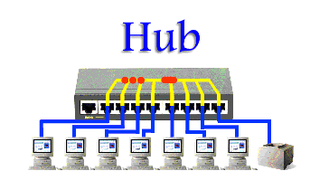
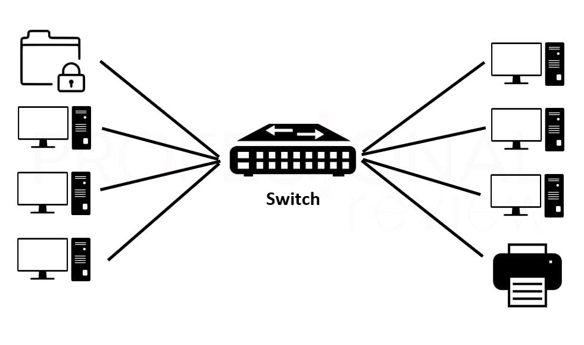
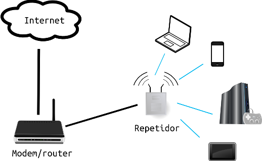
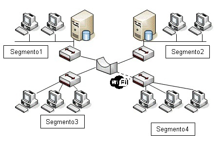

## Apuntes - viernes 9 del 2022   
---------------------------------------------------------------
##### Informacion general
- La tarea se traslada para una semana despues de la fecha establicida, es decir, para el viernes 16 de setiembre del 2022.
- Quiz 2 y 3 para el sábado 10 del 2022 a las 11:55 am.
---------------------------------------------------------------
##### Carnier Sense Multiple Access - Persistend
Escucha el canal y transmite tan pronto como éste esté libref. Si está ocupado, continúa escuchando el medio hasta que lo encuentre libre. Los tiempos de propagación largos deben ser evitados, puesto que si no, aumenta la probabilidad de que varias estaciones intenten acceder al medio a la vez produciendo colisiones, al interpretar que el medio está libre, cuando de hecho ya ha sido ocupado por la trama de otra estación. El retardo impide que las demás se enteren a tiempo. 
Dos o mas estaciones comparten el medio tratando de evitar colisiones. Si se está usando el medio no se hacen envíos, pero si está sin uso, si enviamos.
- Cuando una estación debe envíar datos revisa el canal.
- Existe colisión.
- Cuando el canal está inactivo transmite.

##### Carnier Sense Multiple Access - Non Persistend
Si el medio está libre transmite, si no, espera un tiempo aleatorio extremo. Este tiempo es distinto para dos estaciones lo que evitará las colisiones, pero esto deriva en una pérdida de tiempo al final de cada transmisión. 
- Es más fácil de implementar.
- introduce una mayor latencia. (Incoveniente).
- Tiene un mejor rendimiento porque pasa tramas con menos colisiones, pero presenta mayores retrasos al estarse durmiendo.

##### Carnier Sense Multiple Access - Persistend P
La probabilidad de envio de un paquete es "Q".
Si la transmisión se debe ´postergar, la probabilidad de envio es "q"
Con este método se pretende minimizar las colisiones y el tiempo en el que el canal está desocupado
- Usa canales ranurados.
- Repite el algoritmo hasta que se transmita la trama.

#####  CSMA / CD - Con detección de errores.
Lo que se usa Wireless. Va a detectar cuando se da una colisión, luego espera (Se duerme) un rato y luego ranuda para intentarlo nuevamente
- Retroceso exponencila binario
- Detección rapido de colisión

#####  Metodo basico de mapa de bits
Garantiza transmisiones sin colisiones, pero es muy dificil de implementar
- Al final del periodo  de contención se sabe quienes quieren transmitir
- Se tienen N estaciones , se enumera del 0 a N - 1

#####  Paso de Token
Debe conocer de antemano las estaciones y el orden para pasar el token
- Protocolo libre de colisiones
- Estaciones transmiten por turno
- El orden es predefinido, simula token ring

#####  Ethernet Classic (IEEE   802.3)
Tiene segmentos de 500 mts y en cada 2,5 mts estaba pegada una computadadora.
- Ya no se usa
- Ocupa repetidores
- Ethernet delgada
- Ethernet gruesa

#####  Ethernet Conmutada (802.3)
En half duplex -> tiene solo un par trenzado y comparten el canal.
- El hub fue cambiado por un switch
- Cada estación  cuenta con un cable (par trenzado del telefono)

#####  Hub
Es un dispositivo con puertos donde se conecta la computadora. Un HUB sirve para conectar varios dispositivos simultáneamente a uno solo, lo usamos cuando disponemos de pocas conexiones o no tenemos más disponibles o queremos repartir la señal en varios dispositivos a la vez.

- Half duplex
- Se dan retrasos
- Tiene muchos puertos
- Solo una estación puede transmitir al mismo tiempo
- Las transmisiones se dan por un mecanismo llamado difusión

#####  Switches
Es un dispositivo de interconexión utilizado para conectar equipos en red formando lo que se conoce como una red de área local (LAN) y cuyas especificaciones técnicas siguen el estándar conocido como Ethernet (o técnicamente IEEE 802.3).

- Full duplex
- Permite conectar segmentos VLAN
- Es inteligente para entregar las tramas a las estaciones adecuadas
- Son caros porque tienen las funcionalidad de VLAN
- Si no se utiliza correctamente puede haber fuga de 

#####  Repetidores
Es un dispositivo electrónico que transmite una señal transmitida. Recibe una señal en un frecuencia, luego lo amplifica y lo retransmite. Al amplificar la señal, un repetidor aumenta el rango de transmisión de la señal original.

- Regeneran la señal
- Aplificación de la señal

#####  Bridge
Un bridge conecta segmentos de red formando una sola subred. Funciona a través de una tabla de direcciones MAC detectadas en cada segmento al que está conectado. Cuando detecta que un nodo de uno de los segmentos está intentando transmitir datos a un nodo del otro, el bridge copia la trama para el otro segmento de red, teniendo la capacidad de desechar la trama  en caso de no tener dicho segmento de red como destino.
- Conecta 2 segmentos de red
- Puede incluir las funcionalidades de un repetidor

