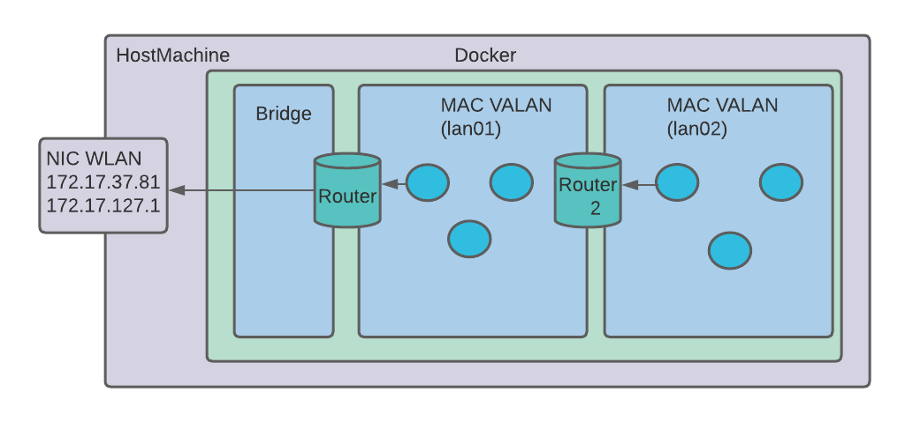

## Apuntes - viernes 9 del 2022 

#### Host machine para el proyecto

Routers tienen una pata en cada una de de las redes

#### DNS
El sistema de nombres de dominio (DNS) es el directorio telefónico de Internet. Las personas acceden a la información en línea a través de nombres de dominio como nytimes.com o espn.com. Los navegadores web interactúan mediante direcciones de Protocolo de Internet (IP). El DNS traduce los nombres de dominio a direcciones IP para que los navegadores puedan cargar los recursos de Internet.
Ejemplo de estructura para el proyecto

No hay que olvidar que se tiene que hacer con todos los demas componentes ademas que tambien se debe implementar de manera dinamica.

Cuando un cliente le pide un ip a dhcp y le da el nombre, el dhcp le dice al dns que lo guarde con el ip que acaba de darle  el cliente.

#### DNS spoofing
Es un método para alterar las direcciones de los servidores DNS que utiliza la potencial víctima y de esta forma poder tener control sobre las consultas que se realizan.

#### IP Address
IP address son direcciones jerarquicas 
Las redes tienen varias configuraciones(Parametros):
* MASK
* numero de RED
* DefaultGateway
* Broadcast

El numero de host es la cantidad de ips que puede tener.
red -> filtro de contenido.

Una máscara de red se define como una combinación de bits que funcionan para delimitar una red de ordenadores y dividir esta red en subredes. Este código de números es usado para realizar correctamente el proceso de transferencia de mensajes entre dispositivos en la misma subred.

El defaultgateway es un parametro opcional, si uno no conoce de quien es el contenido, se lo envia al defaultgateway.

El broadcast es una conexión multipunto en redes IP que permite llegar de forma automática a todos los usuarios de una red sin la necesidad de conocer las respectivas direcciones de destino.

Las direcciones se componen de dos partes: porcion de red y porcion de host.

Si el numero de red es el mismo, el trafico es local.

