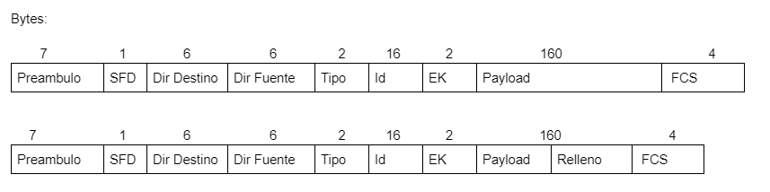

## PC78
## Redes
### Lucky Starr Tech se encuentra desarrollando un protocolo que permita el envío de datos sobre un medio poco confiable, este medio puede verse afectado por radiación electromagnética de aparatos y otros medios de comunicación. En calidad Ingeniero o Ingeniera en telecomunicaciones, a usted se le ha encargado diseñar la trama que será utilizada por el protocolo, algunos detalles importantes (70 pts) :

### a. Los identificadores de destino y fuente tienen un total de 6 octetos cada uno.  
### b. El tamaño máximo del payload (datos) que puede llevar la trama es de 160 bytes, esto debido a que tramas muy grandes pueden causar muchos problemas.  
### c. El contenido puede ir encriptado con llave pública/privada.  
### d. Se debe garantizar la entrega en orden de las tramas.  
### e. Se debe verificar que los datos estén correctos.  
### f. Se debe tomar en cuenta que pueden existir diferentes tipos de tramas.  
### g. Se debe hacer una propuesta con trama de tamaño variable (entre 0 y 160 octetos) y otra con trama de tamaño fijo.  
### h. El header incluyendo la verificación debe ser lo más pequeño posible, se debe trabajar bajo el supuesto de que la trama debe ser lo más pequeña posible. Su propuesta debe hacer un uso eficiente del espacio, debe especificar cuántos bits se van a usar por campo en su trama

- Preámbulo: Se utiliza para permitir que el receptor se sincronice con el emisor.
- SFD:  Indica el inicio de una trama de datos.
- Dir Destino: Contiene la dirección MAC del dispositivo que envía la trama.
- Dir Fuente: Contiene la dirección MAC a la que se envía la trama
Tipo: Tipo de trama	
- ID: Identificador de la trama para mantener el control y orden de la trama.
- Ek: Encriptamiento, llave pública/privada
- Payload: Contiene los datos a transferir entre origen y destino/ en caso de no llegar a 160 datos, este añade datos de relleno.
- FCS: Verificación de los datos.

### Explique detalladamente la razón por la cual Internet Protocol se implementa como un servicio sin conexión en lugar de un servicio orientado a conexión (30 pts).

 Algunas razones por lo que el Internet Protocol se implementa como un servicio sin conexión es por ejemplo que no requiere ningún intercambio inicial de información de control para establecer una conexión de extremo a extremo antes de reenviar los paquetes, además, tampoco requiere campos adicionales en el encabezado de la unidad de datos del protocolo para mantener una conexión establecida. Este proceso reduce en gran medida la sobrecarga del Internet Protocol, por otro lado, se encuentra la selección dinamica de camino y asignación dinamica de ancho banda en donde la selección dinámica del camino permite al tráfico ser encaminado evitando fallas de la red porque los caminos se seleccionan paquete por paquete, y con la asignación dinámica del ancho de banda, se utiliza más eficientemente porque no se afecta a los recursos de red que no se utilicen, tambien, debido a la ausencia de fase de establecimiento de conexión, la transmisión es más rápida.

